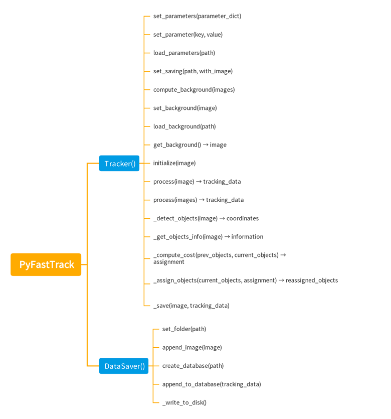

# PyFastTrack

[](https://github.com/FastTrackOrg/PyFastTrack/actions/workflows/linux_tests.yml) [](https://github.com/FastTrackOrg/PyFastTrack/actions/workflows/win_tests.yml) [](https://github.com/FastTrackOrg/PyFastTrack/actions/workflows/macos_tests.yml)

## About

PyFastTrack is a Python library that provides an easy-to-use solution to integrate the FastTrack software tracking technology in Python projects. The tracking parameters configuration and the tracking results will be entirely compatible with FastTrack.

## Roadmap

PyFastTrack is actively developed at a pace depending on the project [funding](https://ko-fi.com/bgallois). The development roadmap is as follows:
Abstract detection and tracking classes.
FastTrack detection and tracking classes one-to-one compatible with FastTrack.
Tracking data exportation base class compatible with FastTrack viewer.
YOLOv8 segmentation detector class.

## Usage

PyFastTrack can be integrated using the high-level API:

```python
import cv2
import numpy as np
import pyfasttrack as ft

tracker = ft.Tracker()
tracker.load_parameters("params.toml")
tracker.load_background("background.pgm")
tracker.set_saving("data.db", with_image=True)

camera = cv2.VideoCapture(0)
tracker.initialize(camera.read()[1])

while(True):
	ret, frame = camera.read()
	if not ret:
		return
	data = tracker.process(frame)
	# Data can be consumed here
```

A low-level API is also available to subclass the Tracker class and reimplement the process method with a custom image analysis pipeline.


